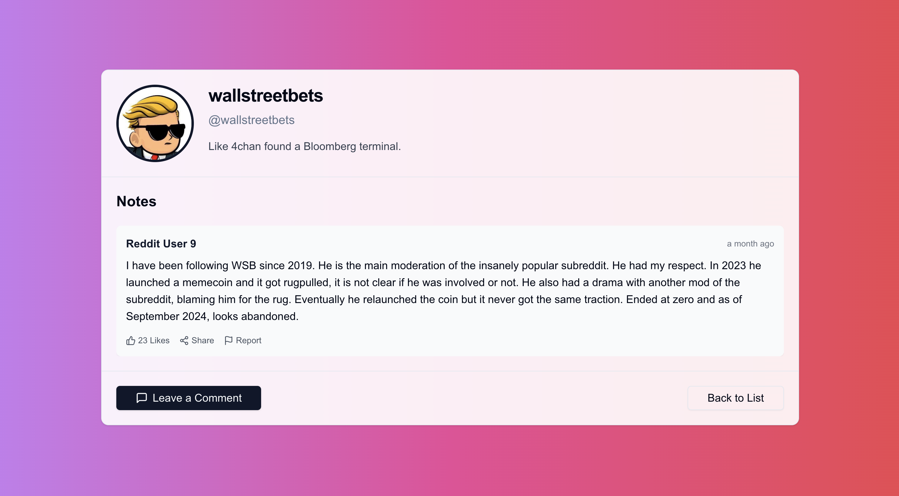
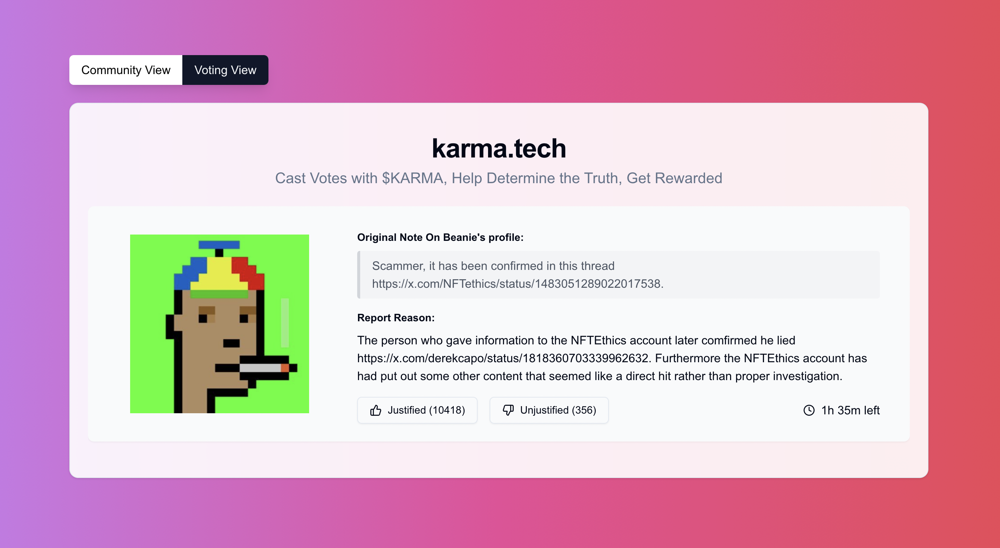

## Community Karma

A decentralized, fact-driven reputation system based on an Optimistic Oracle

Pseudo anonymous online communities liberate us from our geographical background, physical imperfections, or social status. They are the next and better evolution of human interactions. However the primary downfall of said communities is the lack of accountability for actions. Without transparency and robust reputation systems, anonymous spaces can encourage harmful behavior for personal gain.

We need to have a reliable source of truth for individual's reputation. Similar to Twitter's Community Notes, but better: fact-checked, backed by capital, and permanently stored on a distributed digital ledger. Think of it as Proof of Stake for Truth. That's why we built <u>Community Karma</u>.

Currently, we support a curated set of personas from Crypto Twitter. By selecting a profile, you can see verified information about that person, as determined by our oracle.

Notes could range from feedback about past work experiences, warnings about dishonest behavior, or praise for helpful actions. This reputation system provides a transparent way to assess users' trustworthiness, helping communities build a safe, accountable, and well-informed ecosystem.

## Optimistic Oracle

Optimistic Oracles are one of the stepping stones of crypto. For example Optimistic Rollups (most of the biggest L2s on Ethereum) are based on the same principle. Similarly, Polymarket, a leading prediction market, partnered with UMA’s Optimistic Oracle to resolve disputes.

We have developed fully onchain Optimistic Oracle to verify the claims on Community Karma website. Optimistic in the name means it treats information as true by default, unless it’s disputed. If a dispute arises, a 72-hour voting period begins.

While voting period lasts, reported notes are not displayed on people's profiles. Our network of validators conducts research to find out what the objective truth is. They stake their capital on their findings, and the majority vote decides the outcome. Validators who vote against the objective truth are slashed.

To encourage validator participation, we offer a fixed APR distributed based on capital invested to truthful validators. They also get 70% of slashed capital.

#### Reporting Notes

Anyone can dispute a note's accuracy by connecting a wallet and staking tokens, which helps prevent spam and censorship. If the dispute is justified, disputer receives a fixed APR + 30% of slashed capital. Otherwise their stake is slashed.

#### TDLR;

Searchers can report notes they believe to be untruthful, while validators work to establish the objective truth. Both groups compete in their category to earn APR and uncover the truth.

Check out our [Demo](https://www.youtube.com/watch?v=L8pO0j592uE) for UI walkthrough and more.
